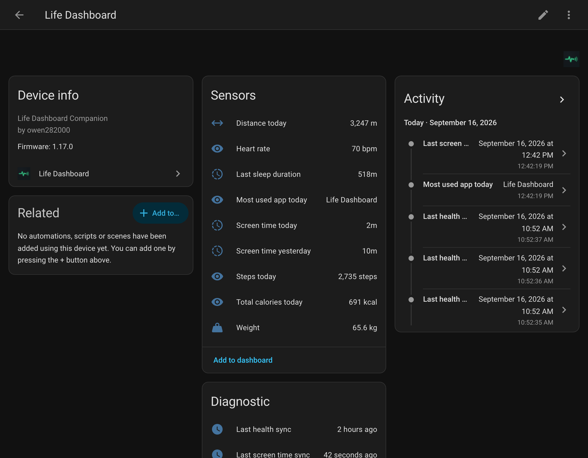
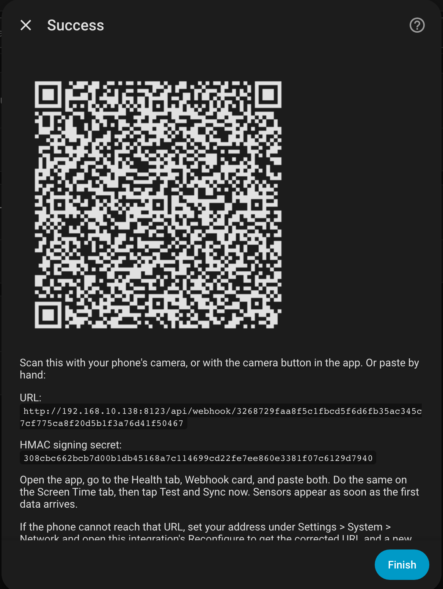
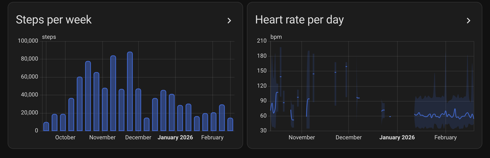

<h1 align="center">Life Dashboard for Home Assistant</h1>

<p align="center">
  Health Connect and screen time from your phone as Home Assistant sensors and long-term statistics.<br>
  The only way to get how long you looked at your phone, and at what, into Home Assistant.<br>
  Paired with a QR code. No MQTT broker, no ports to open, no YAML.
</p>

<p align="center">
  <a href="https://my.home-assistant.io/redirect/hacs_repository/?owner=owen282000&repository=life-dashboard-ha&category=integration"></a>
  <a href="https://github.com/owen282000/life-dashboard-ha/releases/latest"></a>
  <a href="https://github.com/owen282000/life-dashboard-ha/actions/workflows/tests.yml"></a>
  <a href="https://github.com/owen282000/life-dashboard-ha/actions/workflows/validate.yml"></a>
  <a href="https://www.home-assistant.io/"></a>
  <a href="LICENSE"></a>
</p>

<p align="center">
  <a href="#quick-start"><b>Quick start</b></a>
  &nbsp;·&nbsp;
  <a href="https://github.com/owen282000/life-dashboard-companion-app">Android app</a>
  &nbsp;·&nbsp;
  <a href="https://github.com/owen282000/life-dashboard-companion-app-ios">iOS app</a>
  &nbsp;·&nbsp;
  <a href="CHANGELOG.md">Changelog</a>
  &nbsp;·&nbsp;
  <a href="https://github.com/owen282000/life-dashboard-ha/discussions">Discussions</a>
</p>

<p align="center">
  
</p>

The [Life Dashboard Companion](https://github.com/owen282000/life-dashboard-companion-app)
app reads Health Connect and screen time on the phone and posts them to a webhook. This
integration is that webhook, inside Home Assistant: it verifies the signature on every
payload, keeps one device per phone with a sensor for each value, and writes the past
into long-term statistics so a year of history lands on the days it happened.

Health data has other routes into Home Assistant. Screen time has none: no Android app
exports it, no cloud service offers it, and Home Assistant's own companion app does not
read it. This is the one that does, with today's minutes, yesterday's, and the app that
took most of them, next to the steps and the heart rate of the same phone.

## Why this integration

- **Screen time, finally.** Minutes on the phone today and yesterday, and the most used
  app with the top five behind it, as sensors that update on the schedule you set. Nothing
  else brings this into Home Assistant.
- **Two minutes from install to sensors.** Install from HACS, add the integration, scan
  the QR code it shows. Nothing to type, nothing to configure on the phone side.
- **No broker.** The app talks to Home Assistant directly. If you already run MQTT, that
  route keeps working; this one is for everyone who does not want to.
- **Signed, always.** Every payload carries an HMAC-SHA256 signature over a secret this
  integration generated. There is no option to switch it off, so a leaked URL is useless.
- **History that is actually history.** A backfill of a year of readings does not land on
  today. Day totals and hourly ranges go into long-term statistics with their real dates.
- **Nothing double counted.** Re-sent batches, edited records and overlapping windows are
  the app's normal behaviour, and the integration is built for it.
- **Local by default.** With the internal URL your data never leaves your network. The
  external URL and Home Assistant Cloud are there for syncing away from home.

## Works with

| App | Status |
|---|---|
| [Life Dashboard Companion for Android](https://github.com/owen282000/life-dashboard-companion-app) 1.16 or newer | **Fully supported.** Health sensors, screen time, statistics, QR pairing, backfill. 1.17 or newer for step, distance and calorie history. |
| [Life Dashboard Companion for iOS](https://github.com/owen282000/life-dashboard-companion-app-ios) | **Not yet through this integration.** The iOS app reaches Home Assistant through its built-in MQTT Discovery today. Support here is planned; follow [#1](https://github.com/owen282000/life-dashboard-ha/issues/1). |

## Quick start

1. **Install.** Click the button, or add `https://github.com/owen282000/life-dashboard-ha`
   as a custom repository of type *Integration* in HACS. Download **Life Dashboard** and
   restart Home Assistant.

   [](https://my.home-assistant.io/redirect/hacs_repository/?owner=owen282000&repository=life-dashboard-ha&category=integration)

2. **Add the integration.** *Settings > Devices & services > Add integration*, search for
   **Life Dashboard**. Give the phone a name and pick the address it should send to
   (internal is the default and fine at home).

3. **Scan the code.** Point the phone's camera at the QR code in the dialog, or tap the
   scan button in the app. The app shows what it is about to fill in and asks you to
   confirm.

4. **Sync.** Tap **Sync now** in the app. The device appears under
   *Settings > Devices & services > Life Dashboard* with a sensor for every type the
   phone sent.

<table>
  <tr>
    <td align="center"></td>
    <td align="center"></td>
  </tr>
  <tr>
    <td align="center">The pairing dialog</td>
    <td align="center">Statistics graph cards, five months after a backfill</td>
  </tr>
</table>

Needs Home Assistant 2026.3 or newer.

## Pairing

The dialog asks for a name and an address, then shows the QR code with the URL and the
signing secret under it.

| Address | When to use it |
|---|---|
| **Internal URL** | Syncs at home only, and the data never leaves your network. The default. |
| **External URL** | Also syncs away from home. Home Assistant has to be reachable from outside, through Nabu Casa or your own reverse proxy. |
| **Home Assistant Cloud** | Also syncs away from home, with no port forwarding. Needs a subscription; the integration creates a cloudhook for you. |

Three ways to use the code, all ending in the same confirmation dialog on the phone:

- **The phone's camera.** The code is a link that opens the app directly, verified
  against the app's signing certificate. Without the app installed it opens a page that
  says where to get it.
- **The scan button in the app**, on the Webhook card of the Health and Screen Time tabs,
  and as the first choice in the setup wizard.
- **By hand.** Paste the URL and the secret into the Webhook card on both tabs.

The code only carries the address and the secret. Which data types are synced, and on what
schedule, stays a choice on the phone. The secret travels in the part of the link after
the `#`, which a browser never sends to any server.

The name becomes the device name, so two phones in the house become "Owen's Pixel" and
"Partner's phone" rather than two devices that read the same. Add the integration once
per phone. To see the code again, change the address, or rotate the secret, use
**Reconfigure** on the integration.

## What you get

Sensors appear as data arrives, so you only get the types you actually sync. Each sensor
holds the latest value; the past lives in the [statistics](#history).

**Day totals**, from Health Connect's own deduplicated figures, resetting at local
midnight: steps, distance, active calories, total calories.

**Latest reading** of heart rate, resting heart rate, heart rate variability, last sleep
duration, weight, blood pressure (systolic and diastolic), blood glucose, oxygen
saturation, body temperature, skin temperature delta, basal body temperature, respiratory
rate, last drink, body fat, lean body mass, bone mass, body water mass, basal metabolic
rate, VO2 max and height. Each carries the source app and the record id as attributes.

**Screen time**: minutes today, minutes yesterday, and the most used app today with the
top five as an attribute. See [Screen time](#screen-time) below.

**Diagnostics**: last health sync and last screen time sync, as timestamps. A **Test**
ping in the app moves these, which is the quickest way to see that pairing worked.

Event-like data (workouts, meals, mindfulness sessions, cycle tracking) gets no sensor,
because a single value cannot represent it honestly. Mindfulness and exercise do count
towards the day statistics below, and everything is in the webhook payload for an
automation that wants the raw records.

## Screen time

The app reads Android's usage statistics, the same numbers as the Digital Wellbeing
screen, and sends them on their own schedule, separate from the health sync. Three
sensors come out of it:

| Sensor | What it holds |
|---|---|
| `screen_time_today` | Minutes of foreground use since the day boundary, which you set in the app (a "day" can end at 4 AM if that is when you sleep) |
| `screen_time_yesterday` | The finished total for the day before, for a daily automation that does not race the clock |
| `screen_time_top_app` | The app with the most minutes today; the top five with their minutes in the `top_apps` attribute |

Both minute sensors carry the day they describe as an attribute, and update as the
number grows, so a dashboard shows the phone's day as it happens. Every day also goes
into long-term statistics, so a year from now the statistics graph still shows which
weeks the phone won. Two things people do with it:

```yaml
# Dim the lights and say something when the phone passes three hours in a day.
triggers:
  - trigger: numeric_state
    entity_id: sensor.owen_s_pixel_screen_time_today
    above: 180
actions:
  - action: notify.mobile_app_owen_s_pixel
    data:
      message: "Three hours on the phone today. The top app was {{ states('sensor.owen_s_pixel_screen_time_top_app') }}."
```

```yaml
# Yesterday's total in a card, with the top five apps behind it.
type: entity
entity: sensor.owen_s_pixel_screen_time_yesterday
name: Screen time yesterday
attribute: top_apps
```

Screen time is Android only: iOS has no API that lets an app read it. Which apps count
is decided on the phone, so Home Assistant only ever sees what you chose to send.

## History

A sensor can only hold now, so on its own a year of backfilled readings would all land on
today. Instead every payload also feeds long-term statistics, which carry their own dates:

| Statistic | What it holds |
|---|---|
| steps, distance, active calories, total calories | The day's total, from the app's daily totals |
| sleep minutes, exercise minutes, mindfulness minutes | The day's total, from the sessions that ended that day |
| hydration total | Litres drunk that day |
| screen time | Minutes on the phone that day. Every sync carries the last seven days, so a day that was still running when it was sent is corrected by the next one |
| heart rate, weight, blood pressure and the other measured values | Mean, minimum and maximum per hour |

They show up in the entity picker of the **Statistics graph** card under the phone's
name, next to the sensors. The steps chart above is this card:

```yaml
type: statistics-graph
title: Steps per week
chart_type: bar
period: week
days_to_show: 90
stat_types:
  - change
entities:
  - life_dashboard:<entry>_steps   # pick "Owen's Pixel steps" from the picker
```

A backfill from the app fills the statistics for the whole window it covers, and sending
the same window again changes nothing. Step, distance and calorie history needs app 1.17
or newer, which sends the day totals for every backfilled day; older versions only send
today's, and the log says so when a backfill arrives without them.

## In automations

The sensors are ordinary sensors. Two that people set up first:

```yaml
# A goal for the day.
triggers:
  - trigger: numeric_state
    entity_id: sensor.owen_s_pixel_steps_today
    above: 10000
actions:
  - action: notify.mobile_app_owen_s_pixel
    data:
      message: "10,000 steps. Done for today."
```

```yaml
# The phone has not synced for a day, so something is off with the app or the network.
triggers:
  - trigger: template
    value_template: >-
      {{ now() - (states('sensor.owen_s_pixel_last_health_sync') | as_datetime)
         > timedelta(hours=24) }}
```

Entity ids follow the device name: "Owen's Pixel" gives `sensor.owen_s_pixel_...`.

## Why nothing is double counted

The app re-sends data on purpose: a delivery that failed goes into an outbox and comes
back at the next sync, a large backlog is split over several requests, and a backfill
re-sends history with its original timestamps. Health Connect also hands over a record
again after the source app edits it.

So every value carries the moment it describes, and a sensor takes an update only when it
is not older than what it already holds. The statistics are rebuilt from a ledger that
remembers each day and each session by its id, so a repeat changes nothing and a
correction replaces the old figure. Re-delivery is therefore harmless, and an old batch
arriving after a restart cannot overwrite a newer reading.

## Security

- Every payload is signed with HMAC-SHA256 over the raw body, with a secret this
  integration generated when the phone was paired. The signature is checked in constant
  time before anything is parsed; a payload that fails gets a 401 and is logged without
  its contents.
- The webhook id is a long random path, so the URL is not guessable either. The signature
  is what makes a leaked URL harmless.
- With the internal URL, nothing leaves your network. With the external URL, use HTTPS;
  the app refuses plain `http://` unless you allow it on the tab.
- Rotate the secret any time under **Reconfigure**; the app has to be given the new value.

Found a hole in any of this? See [SECURITY.md](SECURITY.md) for private reporting.

## MQTT or this integration

The app also publishes to MQTT with Home Assistant Discovery, and the sensor names here
match those. Pick one: running both gives you two devices holding the same numbers. MQTT
is the better choice if you already have a broker and want the raw records; this
integration is the better choice for everyone else, and the only one with history.

## Troubleshooting

**The app logs a 401.** The secret in the app is not the one this integration has. Open
**Reconfigure** to see the current secret, or scan the code again.

**The app cannot reach the URL.** Set your addresses under *Settings > System > Network*,
then open **Reconfigure** to get the corrected URL. Home Assistant otherwise guesses, and
in a container that guess can be an address only the container can reach.

**The dialog says no internal or external URL is set.** Same place: *Settings > System >
Network*.

**Syncing over plain HTTP fails.** The app refuses `http://` unless you enable **Allow
plain HTTP webhooks** on the tab you are configuring. The pairing dialog offers this when
the address is an internal `http://` one.

**Sensors are "unknown" after a power cut.** Home Assistant only keeps sensor values
across a restart it shut down cleanly. They fill in again at the next sync; the statistics
are unaffected.

**A backfill left the step history empty.** The app is older than 1.17; update it and run
the backfill again. The log names the window when this happens.

Still stuck? [Discussions](https://github.com/owen282000/life-dashboard-ha/discussions)
for questions, [issues](https://github.com/owen282000/life-dashboard-ha/issues/new/choose)
for bugs.

## Roadmap

- Support for the iOS app ([#1](https://github.com/owen282000/life-dashboard-ha/issues/1))
- Listing in the HACS default repository, so no custom repository step is needed

## Development

```sh
python3.13 -m venv .venv
.venv/bin/pip install -r requirements_test.txt
.venv/bin/python -m pytest
```

`scripts/sync-to-dev-ha.sh` copies the integration into a local Home Assistant in Docker
and restarts it. [CONTRIBUTING.md](CONTRIBUTING.md) has the conventions.

## License

MIT, see [LICENSE](LICENSE).
