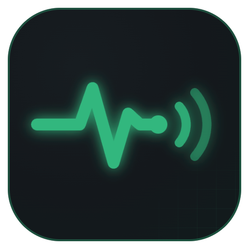
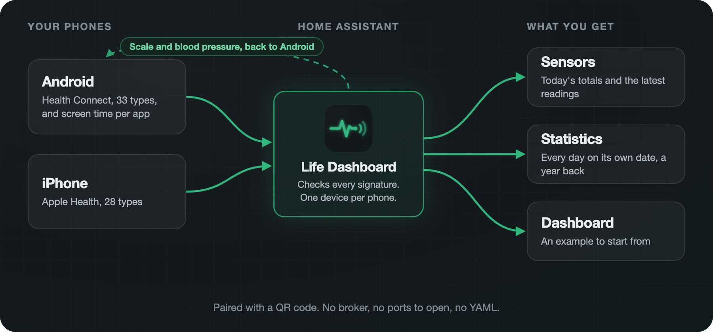

<p align="center">
  
</p>

<h1 align="center">Life Dashboard for Home Assistant</h1>

<p align="center">
  <b>Health Connect or Apple Health from your phone as Home Assistant sensors and long-term statistics.</b><br>
  Sent by the Life Dashboard Companion app on the phone. Screen time per app on Android. Paired with a QR code: no broker, no ports to open, no YAML.
</p>

<p align="center">
  <a href="https://my.home-assistant.io/redirect/hacs_repository/?owner=owen282000&repository=life-dashboard-ha&category=integration"></a>
  <a href="https://github.com/owen282000/life-dashboard-ha/releases/latest"></a>
  <a href="https://github.com/owen282000/life-dashboard-ha/actions/workflows/validate.yml"></a>
  <a href="#quick-start"></a>
  <a href="LICENSE"></a>
</p>

<p align="center">
  <a href="#quick-start"><b>Quick&nbsp;start</b></a>
  &nbsp;·&nbsp;
  <a href="docs/entities.md">Sensors</a>
  &nbsp;·&nbsp;
  <a href="docs/README.md">Docs</a>
  &nbsp;·&nbsp;
  <a href="https://github.com/owen282000/life-dashboard-companion-app">Android&nbsp;app</a>
  &nbsp;·&nbsp;
  <a href="https://github.com/owen282000/life-dashboard-companion-app-ios">iOS&nbsp;app</a>
</p>

<p align="center">
  <picture>
    <source media="(max-width: 600px)" srcset="docs/readme-hero-phone.png">
    
  </picture>
</p>

The [Life Dashboard Companion](https://github.com/owen282000/life-dashboard-companion-app) apps read your health data on the phone and post it to a webhook. This integration is that webhook, inside Home Assistant. It checks the signature on every payload, keeps one device per phone with a sensor for each value, and writes the past into long-term statistics, so a year of history lands on the days it happened. On Android it works the other way too: a weight or blood pressure that Home Assistant already has goes back to the phone and into Health Connect.

<a id="why-this-integration"></a>

## What you get

- **Sensors for today.** Steps, distance and calories as day totals, and the latest heart rate, sleep, weight, blood pressure, glucose and more, each with the app that recorded it.
- **A year of history.** Every day goes into long-term statistics on its own date, so a backfill from the phone fills a year of the **Statistics graph** card.
- **Screen time per app** (Android). Minutes today and yesterday, the most used app and the top five, and a sensor per app if you want one.
- **Back into Health Connect** (Android). Map a scale or blood pressure entity, and the phone writes each new reading into Health Connect.
- **Signed, always.** Every payload is signed with HMAC-SHA256 and a secret this integration created. A leaked URL is useless without the secret, and there's no switch to turn signing off.
- **Nothing counted twice.** The apps re-send data on purpose, and the integration is built for it: a repeat leaves sensors, day totals and sessions as they were, and a correction replaces the old figure.

[All sensors, statistics and attributes](docs/entities.md) are in the docs, with automations and an [example dashboard](examples/dashboard.yaml) to start from.

## How it works

The phone pushes; nothing here polls. The app reads Health Connect or Apple Health on the schedule you set in it and posts a signed payload to this integration's webhook.

<p align="center">
  <picture>
    <source media="(max-width: 600px)" srcset="docs/how-it-works-phone.png">
    
  </picture>
</p>

[How it works](docs/how-it-works.md) explains the timing, why nothing is counted twice, and the security design.

## Part of Life Dashboard

Life Dashboard is four projects, and you only install the parts you need. Put the app on each phone, then choose where the data goes. Both apps send the same payload, so an Android phone and an iPhone can share one Home Assistant or one stack.

<table>
<thead>
<tr>
<th align="left" width="50%">On your phone</th>
<th align="left" width="50%">Where the data goes</th>
</tr>
</thead>
<tbody>
<tr>
<td valign="top">
<a href="https://github.com/owen282000/life-dashboard-companion-app">Android app</a><br>
<sub>Health Connect and screen time</sub><br><br>
<a href="https://github.com/owen282000/life-dashboard-companion-app-ios">iPhone app</a><br>
<sub>Apple Health</sub>
</td>
<td valign="top">
<b>Home Assistant integration</b><br>
<sub>Sensors and a year of history</sub><br><br>
<a href="https://github.com/owen282000/life-dashboard-stack">Grafana stack</a><br>
<sub>Postgres and Grafana dashboards</sub><br><br>
An MQTT broker or a webhook of your own<br>
<sub>Built into both apps, for n8n, Node-RED or a script</sub>
</td>
</tr>
</tbody>
</table>

## Works with

| App | What you get |
|---|---|
| [Android app](https://github.com/owen282000/life-dashboard-companion-app), 1.17.0 or newer | Everything: health sensors, screen time, statistics, QR pairing and backfill. Sending measurements to the phone needs 1.20.0 or newer, and choosing which apps count toward screen time needs 1.23.0. |
| [iOS app](https://github.com/owen282000/life-dashboard-companion-app-ios), 1.4.0 or newer | Health sensors, daily totals, statistics, QR pairing and backfill. No screen time, because iOS doesn't let an app send it anywhere, and no measurements to the phone. Total calories arrive only on days with resting energy, which usually means an Apple Watch. There's no App Store build yet; you build it with Xcode. |

## Quick start

You need Home Assistant 2026.3 or newer with [HACS](https://hacs.xyz/docs/use/), and one of the apps on the phone. The Android app installs from [GitHub Releases](https://github.com/owen282000/life-dashboard-companion-app/releases/latest) or [Obtainium](https://github.com/owen282000/life-dashboard-companion-app#install); an F&#8209;Droid listing is in review, and a Google Play version comes later. The iOS app has no App Store or TestFlight build yet: you [build it with Xcode](https://github.com/owen282000/life-dashboard-companion-app-ios#build-and-install) and install it on your own iPhone.

1. **Install.** Click the button, or add `https://github.com/owen282000/life-dashboard-ha` in HACS as a custom repository of type **Integration**. Download **Life Dashboard** and restart Home Assistant.

   [](https://my.home-assistant.io/redirect/hacs_repository/?owner=owen282000&repository=life-dashboard-ha&category=integration)

2. **Add the integration.** Go to **Settings > Devices & services > Add integration** and search for **Life Dashboard**. Give the phone a name. The address is filled in with the one your browser is using; keep it or change it.
3. **Scan the code.** Point the phone's camera at the QR code, or use the scan button in the app. The app shows what it's about to fill in and asks you to confirm.
4. **Sync.** Tap **Sync Now** in the app. The phone shows up as a device under **Settings > Devices & services > Life Dashboard**, with a sensor for every type it sent.

<p align="center">
  
</p>

[Pairing](docs/pairing.md) covers which address to use, syncing away from home and adding a second phone.

## MQTT or this integration

The apps can also publish over MQTT with Home Assistant Discovery, which creates the same sensors (three of them under another name). Pick one: running both gives you two devices with the same numbers. MQTT suits a setup that already has a broker and only wants the current values. This integration suits everyone else, and it's the only route with backfilled history, a screen time sensor per app and measurements back to the phone.

<a id="why-is-this-not-part-of-the-companion-app"></a>

<details>
<summary><b>Already use the Home Assistant companion app?</b></summary>

<br>

Keep it. It handles presence, notifications and device sensors, and the Life Dashboard apps don't try to. They work side by side.

On Android, the companion app has Health Connect sensors too. Each shows the latest value or a daily total, and its [documentation](https://companion.home-assistant.io/docs/core/sensors) says "only the last 30 days of data is used". For screen time it has a last used app sensor, but no minutes per app. On an iPhone, the companion app has had Apple Health sensors since 2026.8 ([#5272](https://github.com/home-assistant/iOS/pull/5272), [#5638](https://github.com/home-assistant/iOS/pull/5638)), each with today's total or the newest reading. Their history starts the day you switch them on.

Neither backfills history, and neither has screen time per app. This integration adds up to a year of history in long-term statistics with each day on its own date, a screen time sensor per app and, on Android, readings written back into Health Connect. The Android app's [full comparison](https://github.com/owen282000/life-dashboard-companion-app/blob/main/docs/features.md#how-this-compares-to-the-home-assistant-companion-app) goes row by row.

</details>

## Screen time

On Android, the app sends how long you used the phone and each app, from the same numbers as Digital Wellbeing. You get `screen_time_today`, `screen_time_yesterday` and `most_used_app_today`, with the top five apps as an attribute, and every day goes into long-term statistics. The apps you use also get a sensor each, created disabled, so you only switch on the ones you care about. Which apps count is decided on the phone, so Home Assistant only sees what you chose to send.

```yaml
# Notify at three hours of screen time.
triggers:
  - trigger: numeric_state
    entity_id: sensor.<phone>_screen_time_today
    above: 180
actions:
  - action: notify.mobile_app_<phone>
    data:
      message: >-
        Three hours on the phone today.
        Top app: {{ states('sensor.<phone>_most_used_app_today') }}.
```

[Screen time in detail](docs/entities.md#screen-time) covers the per-app sensors and more automations.

## Sending measurements to the phone

**Configure** on the integration maps one entity per type to a phone, such as a scale that Home Assistant sees over Bluetooth, a blood pressure monitor that an integration polls or a height in an input number. Weight, body fat, lean body mass, bone mass, body water mass, height and blood pressure are supported.

In the Android app, turn on those types under **Receive** on the **Health** tab. From then on the app writes every new value into Health Connect, and Samsung Health and Google Health pick up the weight and body fat from there. [Sending measurements to the phone](docs/sending-to-the-phone.md) explains the mapping, the timing and what happens to a reading the phone refuses.

## Security

Every payload is signed with HMAC-SHA256 over the raw body and checked in constant time before anything is parsed. The webhook ID is a long random path, and the responses that carry readings to the phone are signed too. With your home network address, nothing leaves your network; away from home, use HTTPS or Home Assistant Cloud. The design is in [How it works](docs/how-it-works.md), and [SECURITY.md](SECURITY.md) explains how to report a problem privately.

## Documentation

- [Pairing](docs/pairing.md): addresses, syncing away from home, two phones, reconfiguring
- [Sensors and statistics](docs/entities.md): every entity, screen time per app, history, automations and the example dashboard
- [Sending measurements to the phone](docs/sending-to-the-phone.md): scales and blood pressure monitors into Health Connect
- [How it works](docs/how-it-works.md): timing, deduplication and security
- [Troubleshooting](docs/troubleshooting.md): the questions that come up most, diagnostics and debug logging
- [Changelog](CHANGELOG.md)

<a id="troubleshooting"></a>

## Help and contributing

Start with [Troubleshooting](docs/troubleshooting.md). Questions go to [Discussions](https://github.com/owen282000/life-dashboard-ha/discussions), bugs to [issues](https://github.com/owen282000/life-dashboard-ha/issues/new/choose). **Download diagnostics** on the integration gives a file to attach, with the secret redacted and no health data in it.

To work on the integration:

```sh
python3.13 -m venv .venv
.venv/bin/pip install -r requirements_test.txt
.venv/bin/python -m pytest
```

`scripts/sync-to-dev-ha.sh` copies the integration into a local Home Assistant in Docker and restarts it. [CONTRIBUTING.md](CONTRIBUTING.md) has the conventions.

## Roadmap

- A listing in the HACS default repository, so the custom repository step goes away

## Support the project

Stars, shares and good bug reports all help. This is a one-person project, but your setup doesn't depend on that person: there's no server of mine to switch off, your history lives in your own Home Assistant, and the code is MIT. If you want to chip in for the evenings that go into it, there's [Ko-fi](https://ko-fi.com/owen282000). The integration stays free and open source either way.

MIT licensed. See [LICENSE](LICENSE).

<p align="center">
  <sub>Made by <a href="https://github.com/owen282000">Owen Vogelaar</a> for the self-hosting and quantified self crowd.</sub>
</p>
