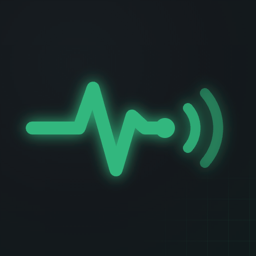
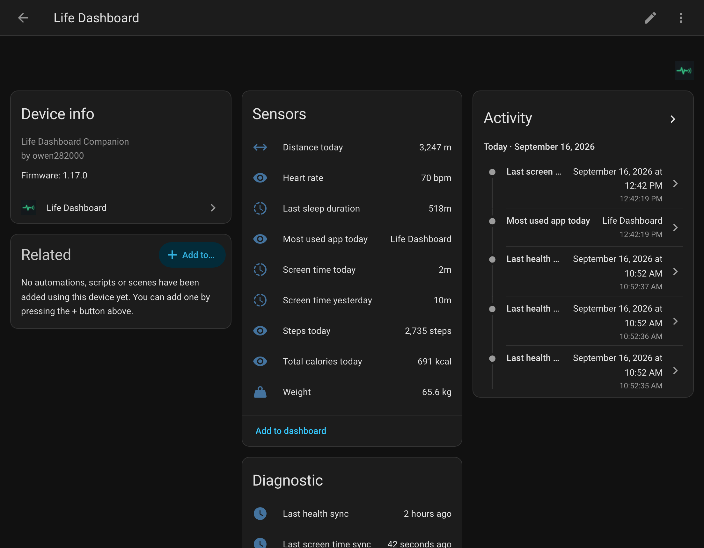
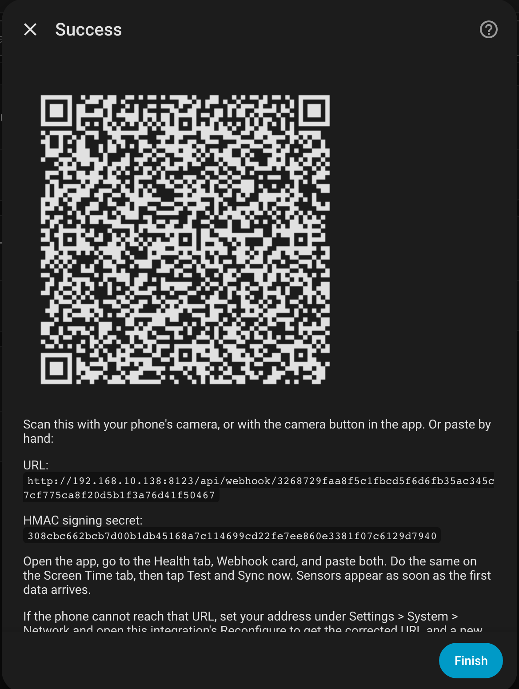
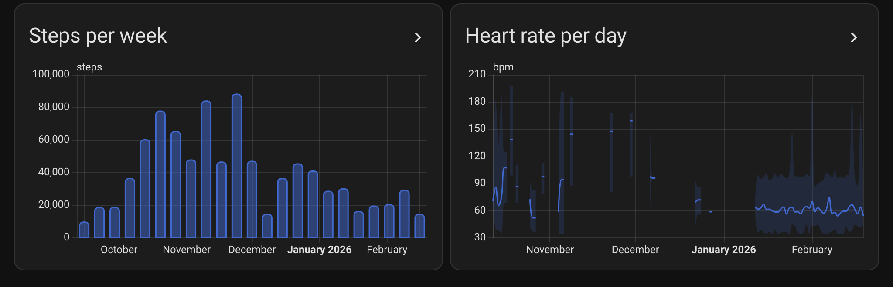
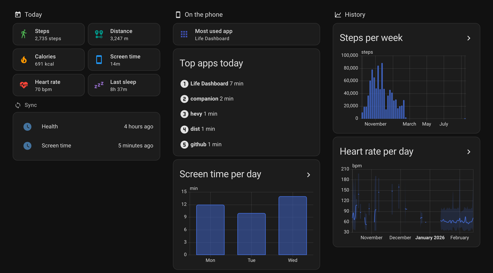

<h1 align="center"> Life Dashboard for Home Assistant</h1>

<p align="center">
  Health Connect or Apple Health from your phone as Home Assistant sensors and long-term statistics.<br>
  On Android also screen time: how long you looked at your phone today, and at what, next to your steps and heart rate.<br>
  And the other way: the weight from the scale in the bathroom into Health Connect on an Android phone.<br>
  Paired with a QR code. No MQTT broker, no ports to open, no YAML.
</p>

<p align="center">
  <a href="https://my.home-assistant.io/redirect/hacs_repository/?owner=owen282000&repository=life-dashboard-ha&category=integration"></a>
  <a href="https://github.com/owen282000/life-dashboard-ha/releases/latest"></a>
  <a href="https://github.com/owen282000/life-dashboard-ha/actions/workflows/tests.yml"></a>
  <a href="https://github.com/owen282000/life-dashboard-ha/actions/workflows/validate.yml"></a>
  <a href="https://www.home-assistant.io/"></a>
  <a href="LICENSE"></a>
</p>

<p align="center">
  <a href="#quick-start"><b>Quick start</b></a>
  &nbsp;·&nbsp;
  <a href="https://github.com/owen282000/life-dashboard-companion-app">Android app</a>
  &nbsp;·&nbsp;
  <a href="https://github.com/owen282000/life-dashboard-companion-app-ios">iOS app</a>
  &nbsp;·&nbsp;
  <a href="https://github.com/owen282000/life-dashboard-ha/discussions">Discussions</a>
  &nbsp;·&nbsp;
  <a href="CHANGELOG.md">Changelog</a>
</p>

<p align="center">
  
</p>

The [Life Dashboard Companion](https://github.com/owen282000/life-dashboard-companion-app)
app for Android reads Health Connect and screen time on the phone and posts them to a
webhook. This integration is that webhook, inside Home Assistant: it verifies the
signature on every payload, keeps one device per phone with a sensor for each value, and
writes the past into long-term statistics so a year of history lands on the days it
happened. It also answers: measurements that arrive in Home Assistant from a scale or a
blood pressure monitor go back to the phone in that same exchange, and the app writes
them to Health Connect, where Samsung Health and Google Health read them.

Since 0.7.1 the [iOS app](https://github.com/owen282000/life-dashboard-companion-app-ios)
1.4.0 or newer works with it too: Apple Health data as sensors, day totals and long-term
statistics, paired by QR code. Screen time and receiving measurements from Home
Assistant are Android only.

Health data has other routes into Home Assistant: the official companion app reads a
handful of Health Connect types, and the Android app's own MQTT route carries all 33.
Screen time has none of those. No Android app exports it, no cloud service offers it,
and the companion app does not read it. This integration does, with today's minutes,
yesterday's, and the app that took most of them, next to the steps and the heart rate of
the same phone.

## How it works

The phone pushes; nothing here polls. The app reads Health Connect and screen time on
Android, or Apple Health on an iPhone, on the schedule you set in it (an interval, or
fixed times, which iOS treats as the earliest moment) and posts a signed payload to this
integration's webhook. Each value arrives with the moment it describes: the sensors take
the newest, the statistics take every day and hour. A Home Assistant restart changes
nothing on the phone; the sensors keep their last values and the next sync fills in
whatever happened meanwhile.

## Why this integration

- **Screen time, finally.** Minutes on the phone today and yesterday, and the most used
  app with the top five behind it, as sensors that update on the schedule you set
  (Android only).
- **Two minutes from install to sensors.** Install from HACS, add the integration, scan
  the QR code it shows. Nothing to type, nothing to configure on the phone side.
- **No broker.** The app talks to Home Assistant directly. If you already run MQTT, that
  route keeps working; this one is for everyone who does not want to.
- **Signed, always.** Every payload carries an HMAC-SHA256 signature over a secret this
  integration generated. There is no option to switch it off, so a leaked URL is useless.
- **History that is actually history.** A backfill of a year of readings does not land on
  today. Day totals and hourly ranges go into long-term statistics with their real dates.
- **Nothing double counted.** Re-sent batches, edited records and overlapping windows are
  the app's normal behaviour, and the integration is built for it.
- **Local by default.** With the internal URL your data never leaves your network. The
  external URL and Home Assistant Cloud are there for syncing away from home.
- **Both ways.** A weight, a body composition or a blood pressure that Home Assistant
  already has goes to the phone's Health Connect, per type, from the entity you choose
  (Android only).
  Nothing else on the phone has to change: it collects on its next sync.

## Works with

| App | Status |
|---|---|
| [Life Dashboard Companion for Android](https://github.com/owen282000/life-dashboard-companion-app) 1.17 or newer | **Fully supported.** Health sensors, screen time, statistics, QR pairing, backfill. Receiving measurements on the phone needs 1.20 or newer. |
| [Life Dashboard Companion for iOS](https://github.com/owen282000/life-dashboard-companion-app-ios) 1.4.0 or newer | **Supported, without what iOS cannot do.** Health sensors, day totals, statistics, QR pairing. No screen time (iOS has no API an app can read it with) and no measurements to the phone. Distance counts walking and running only, and total calories arrive only on days with resting energy, which usually means a Watch. |

## Quick start

Needs Home Assistant 2026.3 or newer, and the Android or the iOS app.

1. **Install.** Click the button, or add `https://github.com/owen282000/life-dashboard-ha`
   as a custom repository of type *Integration* in HACS. Download **Life Dashboard** and
   restart Home Assistant.

   [](https://my.home-assistant.io/redirect/hacs_repository/?owner=owen282000&repository=life-dashboard-ha&category=integration)

2. **Add the integration.** *Settings > Devices & services > Add integration*, search for
   **Life Dashboard**. Give the phone a name. The address is filled in with the one your
   browser is using; keep it, or change it.

3. **Scan the code.** The dialog shows it next to three short steps. Point the phone's
   camera at it, or tap the scan button in the app; the app shows what it is about to
   fill in and asks you to confirm.

4. **Sync.** Tap **Sync now** in the app. The device appears under
   *Settings > Devices & services > Life Dashboard* with a sensor for every type the
   phone sent.

<table>
  <tr>
    <td align="center"></td>
    <td align="center"></td>
  </tr>
  <tr>
    <td align="center">The pairing dialog</td>
    <td align="center">Statistics graph cards, five months after a backfill</td>
  </tr>
</table>

## MQTT or this integration

The app also publishes to MQTT with Home Assistant Discovery, and the sensor names here
match those. Pick one: running both gives you two devices holding the same numbers. MQTT
is the better choice if you already have a broker and want the raw records; this
integration is the better choice for everyone else, and the only one with history.

## Pairing

The dialog asks for a name and an address, then shows the QR code with three steps
beside it. The URL and the signing secret are behind **Or paste by hand**, for a phone
that cannot scan. The address is prefilled with the one your browser is using at that
moment, which is usually the right one; it is a plain text field, so change it when it
is not.

| Address | What it means for the phone |
|---|---|
| **Your home network address**, like `http://192.168.1.10:8123` | Syncs at home only, and the data never leaves your network. |
| **Your public address**, like `https://home.example.com` | Also syncs away from home. Home Assistant has to be reachable from outside, through your own reverse proxy or Nabu Casa. |
| **Use Home Assistant Cloud instead** (a checkbox, shown with a subscription) | Also syncs away from home, with no port forwarding. The integration creates a cloudhook for you and the address field is not used. |

Three ways to use the code, all ending in the same confirmation dialog on the phone:

- **The phone's camera.** On Android the code is a link that opens the app directly,
  verified against the app's signing certificate; without the app installed it opens a
  page that says where to get it. An iPhone's camera always opens that pairing page in
  Safari, and a button on the page hands the code to the app.
- **The scan button in the app**: on Android on the Webhook card of the Health and
  Screen Time tabs, and as the first choice in the setup wizard; on an iPhone
  **Scan a pairing code** under Webhook URLs on the Health tab.
- **By hand.** Paste the URL and the secret into the webhook settings of the app: on
  Android on both tabs.

The code only carries the address and the secret. Which data types are synced, and on what
schedule, stays a choice on the phone. The secret travels in the part of the link after
the `#`, which a browser never sends to any server.

The name becomes the device name, so two phones in the house become "Owen's Pixel" and
"Partner's phone" rather than two devices that read the same. Add the integration once
per phone. To see the code again, change the address, or rotate the secret, use
**Reconfigure** on the integration.

## What you get

Sensors appear as data arrives, so you only get the types you actually sync. Each sensor
holds the latest value; the past lives in the [statistics](#history). The tables give the
last part of each entity id; the first part is the device name, so "Owen's Pixel" gives
`sensor.owen_s_pixel_steps_today`.

**Day totals**, from Health Connect's own deduplicated figures (HealthKit's statistics on
an iPhone), resetting at local midnight. Each carries the day it describes as a `date` attribute.

| Sensor | Unit |
|---|---|
| `steps_today` | steps |
| `distance_today` | m |
| `active_calories_today` | kcal |
| `total_calories_today` | kcal |

**Latest reading**, with the source app and the record id as attributes.

| Sensor | Unit | | Sensor | Unit |
|---|---|---|---|---|
| `heart_rate` | bpm | | `body_temperature` | °C |
| `resting_heart_rate` | bpm | | `skin_temperature_delta` | °C |
| `heart_rate_variability` | ms | | `basal_body_temperature` | °C |
| `last_sleep_duration` | min | | `respiratory_rate` | breaths/min |
| `weight` | kg | | `last_drink` | L |
| `blood_pressure_systolic` | mmHg | | `body_fat` | % |
| `blood_pressure_diastolic` | mmHg | | `lean_body_mass` | kg |
| `blood_glucose` | mmol/L | | `bone_mass` | kg |
| `oxygen_saturation` | % | | `body_water_mass` | kg |
| `basal_metabolic_rate` | kcal/d | | `vo2_max` | mL/min/kg |
| `height` | m | | | |

**Screen time**, see [below](#screen-time).

| Sensor | Unit | Attributes |
|---|---|---|
| `screen_time_today` | min | `date`, `app_count`, `top_apps` (the top five with their minutes) |
| `screen_time_yesterday` | min | `date`, `app_count`, `top_apps` |
| `most_used_app_today` | the app's name | `package`, `minutes`, `date` |

**Diagnostic**: `last_health_sync` and `last_screen_time_sync`, as timestamps. A
**Test** ping in the app moves these, which is the quickest way to see that pairing
worked. A backfill does not: it is one request per chunk, and the next regular sync
moves them.

Event-like data (workouts, meals, mindfulness sessions, cycle tracking) gets no sensor,
because a single value cannot represent it honestly. Mindfulness and exercise do count
towards the day statistics below. For the raw records, use the app's plain webhook route
into an automation, or MQTT; this integration does not fire events with them.

## Screen time

The app reads Android's usage statistics, the same numbers as the Digital Wellbeing
screen, and sends them on their own schedule, separate from the health sync. Three
sensors come out of it:

| Sensor | What it holds |
|---|---|
| `screen_time_today` | Minutes of foreground use since the day boundary, which you set in the app (a "day" can end at 4 AM if that is when you sleep) |
| `screen_time_yesterday` | The finished total for the day before, for a daily automation that does not race the clock |
| `most_used_app_today` | The app with the most minutes today, with its package name and minutes as attributes. The top five with their minutes are the `top_apps` attribute of the two minute sensors |

Both minute sensors carry the day they describe as an attribute, and update as the
number grows, so a dashboard shows the phone's day as it happens. Every day also goes
into long-term statistics, so a year from now the statistics graph still shows which
weeks the phone won. Two things people do with it:

```yaml
# Dim the lights and say something when the phone passes three hours in a day.
triggers:
  - trigger: numeric_state
    entity_id: sensor.owen_s_pixel_screen_time_today
    above: 180
actions:
  - action: notify.mobile_app_owen_s_pixel
    data:
      message: "Three hours on the phone today. The top app was {{ states('sensor.owen_s_pixel_most_used_app_today') }}."
```

```yaml
# Yesterday's total and its top five apps in a card.
type: markdown
title: Yesterday on the phone
content: >-
  {{ states('sensor.owen_s_pixel_screen_time_yesterday') }} minutes.
  {{ state_attr('sensor.owen_s_pixel_screen_time_yesterday', 'top_apps') }}
```

Screen time is Android only: iOS has no API that lets an app read it. Which apps count
is decided on the phone, so Home Assistant only ever sees what you chose to send.

## A dashboard to start from

[examples/dashboard.yaml](examples/dashboard.yaml) is a view for one phone in three
sections: today's tiles with a body card and the sync times, the phone with its most
used app, the top five and screen time per day, and history with steps per week and
heart rate per day. Paste it into a new dashboard's raw configuration editor, replace
the phone's name in the entity ids, and drop the tiles and rows for types you do not
sync. The last sleep tile shows hours and minutes once the sensor's unit is set to
`h` in its settings, with the display precision raised to four decimals; Home
Assistant converts, and with the native `min` it shows minutes only. The frontend
rounds down when it splits hours into minutes, so a minute can go missing there.

<p align="center">
  
</p>

That is the view on a phone that backfilled five months and then went quiet, with the
two long graphs widened from 90 and 30 days to a year so the backfill shows.

## History

A sensor can only hold now, so on its own a year of backfilled readings would all land on
today. Instead every payload also feeds long-term statistics, which carry their own dates:

| Statistic | What it holds |
|---|---|
| steps, distance, active calories, total calories | The day's total, from the app's daily totals |
| sleep minutes, exercise minutes, mindfulness minutes | The day's total, from the sessions that ended that day |
| hydration total | Litres drunk that day |
| screen time | Minutes on the phone that day. Every sync carries the last seven days, so a day that was still running when it was sent is corrected by the next one |
| heart rate, weight, blood pressure and the other measured values | Mean, minimum and maximum per hour |

They show up in the entity picker of the **Statistics graph** card under the phone's
name, next to the sensors. The steps chart above is this card:

```yaml
type: statistics-graph
title: Steps per week
chart_type: bar
period: week
days_to_show: 90
stat_types:
  - change
entities:
  - life_dashboard:<entry>_steps   # pick "Owen's Pixel steps" from the picker
```

A backfill from the app fills the statistics for the whole window it covers, and sending
the same window again changes nothing.

## Sending measurements to the phone

The other direction. A scale that Home Assistant sees over Bluetooth, a blood pressure
monitor that an integration polls, a height you keep in an input number: **Configure**
on the integration maps one entity per Health Connect type to a phone, and the app
writes every new value to Health Connect. What shows up in Samsung Health or Google
Health from there is theirs to decide: Samsung documents weight, body fat, height and
blood pressure as synchronised, and does not list lean body mass, bone mass or body
water mass. Health Connect itself is what this integration and the app can promise.
This is Android only: the iOS app does not receive measurements from Home Assistant.

| Type | What the entity needs | Health Connect record |
|---|---|---|
| Weight, lean body mass, bone mass, body water mass | A mass unit (kg, g, lb, st, oz) | WeightRecord, LeanBodyMassRecord, BoneMassRecord, BodyWaterMassRecord |
| Height | A length unit (m, cm, ft, in) | HeightRecord |
| Body fat | % | BodyFatRecord |
| Blood pressure | Two entities, systolic and diastolic, in mmHg or kPa | BloodPressureRecord, with the body position and cuff location you set |

BMI, muscle mass and visceral fat are not offered: Health Connect has no record for
them, and Samsung Health computes BMI itself from weight and height.

How it goes:

1. **Configure** on the integration: open the section for the type, pick the entity,
   save. Each type has an optional **Measured at** slot for a timestamp sensor that holds
   when the measurement was taken, such as BodyMiScale's last measurement time or an
   Omron's timestamp; without one, the moment the value changed in Home Assistant is
   used, and the app's log says so.
2. In the app, on the Health Connect tab, open **Receive** and turn on the types you
   want. Each asks for its write permission once. The app lists only the types you
   mapped here.
3. Step on the scale. On its next sync (or its next heartbeat, when there is nothing to
   send) the phone collects the reading and writes it. The app shows what it wrote.

Values are converted to what Health Connect wants, on the unit the entity carries at
that moment, without rounding. The same value reported again within ten minutes is the
same measurement, so a scale that advertises one weighing for a while, or an
integration that polls an unchanged value, produces one record; the same weight the
next morning is a new one. A different value on the same moment is a correction and
replaces the earlier record. Systolic and diastolic that change within ninety seconds of
each other are one record, timed on the systolic.

A reading waits until the phone confirms it, so a failed delivery, a lost outbox or a
reinstalled app costs nothing: Health Connect treats a reading it already has as the
same record. A phone that never comes back does not grow the queue without end: ninety
days and five hundred readings per entity, oldest out first.

A measurement that came in through Home Assistant does not appear a second time as the
phone's own sensor: the app skips what it wrote itself when it reads Health Connect, and
this integration ignores those records too. The weight is already in Home Assistant.

**Send history to phone**, a button on the device, queues the last thirty days of the
mapped entities from the recorder, for the measurements from before you set this up or
from a restart that missed one. The `life_dashboard.queue_history` service does the
same with a window of up to ninety days, which is how long the queue keeps a reading,
and a choice of types. Readings older than thirty days only arrive with **Accept older
measurements** on in the app, and a value that stayed the same is one row in the
recorder, so two equal weighings in a row come back as one; for blood pressure the half
that did not change takes its last known value. Pressing twice changes nothing, and a
reading the phone already wrote or refused is not queued again.

With two phones in the house, each phone has its own mapping: Owen's weight goes to
Owen's phone, and nothing goes to the other one unless you map it there. A phone that
refuses a type (no permission, or an app too old for it) gets a repair on the entry that
says what to do, and the refused readings are not offered again; the button sends them
once the permission is there.

## In automations

The sensors are ordinary sensors. Two that people set up first:

```yaml
# A goal for the day.
triggers:
  - trigger: numeric_state
    entity_id: sensor.owen_s_pixel_steps_today
    above: 10000
actions:
  - action: notify.mobile_app_owen_s_pixel
    data:
      message: "10,000 steps. Done for today."
```

```yaml
# The phone has not synced for a day, so something is off with the app or the network.
triggers:
  - trigger: template
    value_template: >-
      {{ now() - (states('sensor.owen_s_pixel_last_health_sync') | as_datetime)
         > timedelta(hours=24) }}
```

Entity ids follow the device name: "Owen's Pixel" gives `sensor.owen_s_pixel_...`.

## Why nothing is double counted

The app re-sends data on purpose: a delivery that failed goes into an outbox and comes
back at the next sync, a large backlog is split over several requests, and a backfill
re-sends history with its original timestamps. Health Connect also hands over a record
again after the source app edits it.

So every value carries the moment it describes, and a sensor takes an update only when it
is not older than what it already holds. The statistics are rebuilt from a ledger that
remembers each day and each session by its id, so a repeat changes nothing and a
correction replaces the old figure. Re-delivery is therefore harmless, and an old batch
arriving after a restart cannot overwrite a newer reading.

## Security

- Every payload is signed with HMAC-SHA256 over the raw body, with a secret this
  integration generated when the phone was paired. The signature is checked in constant
  time before anything is parsed; a payload that fails gets a 401 and is logged without
  its contents.
- The webhook id is a long random path, so the URL is not guessable either. The signature
  is what makes a leaked URL harmless.
- The answer that carries readings to the phone is signed as well, over its exact bytes,
  with a key derived from the secret rather than the secret itself, and bound to the
  request it answers. The app verifies that before it writes anything, also over plain
  HTTP, so a proxy or anyone on the network cannot put a measurement in your health
  record. The answer never contains the secret, and the phone's reply to it carries ids
  and codes, never values.
- With the internal URL, nothing leaves your network. With the external URL, use HTTPS;
  the Android app refuses plain `http://` unless you allow it in the app, and the iOS
  app only sends plain HTTP to an IP address or a `.local` name. Over plain HTTP the
  signature still guarantees that nothing was changed on the way, but the measurements
  going to the phone travel readable on that network, like the payloads coming from it.
- Rotate the secret any time under **Reconfigure**; the app has to be given the new value.

Found a hole in any of this? See [SECURITY.md](SECURITY.md) for private reporting.

## Troubleshooting

**The app logs a 401.** The secret in the app is not the one this integration has. Open
**Reconfigure** to see the current secret, or scan the code again.

**The app cannot reach the URL.** Open **Reconfigure**, put in the address the phone can
reach (your LAN address at home, your public address elsewhere), and scan the new code.

**Syncing over plain HTTP fails.** The Android app refuses `http://` unless **Allow
plain HTTP webhooks** is on: one switch under **Advanced**, shown on both tabs, and also
in the app's own pairing dialog when the scanned address is `http://`. The integration's
pairing dialog has no such option. An iPhone has no switch at all: iOS allows plain HTTP
only to an IP address like `http://192.168.1.10:8123` or a `.local` name, and the app
refuses to pair any other `http://` address. Use **Reconfigure** to put in the IP
address or an `https://` address, and scan the new code.

**Sensors are "unknown" after a power cut.** Home Assistant only keeps sensor values
across a restart it shut down cleanly. They fill in again at the next sync; the statistics
are unaffected.

**A backfill left the step history empty.** The app is older than 1.17 on Android or 1.4.0
on iOS; update it and run the backfill again. The log names the window when this happens.

**A measurement is not reaching the phone.** Only the Android app receives them. Check
that the type is on under **Receive** in the app and that the app is 1.20 or newer; a
repair on the entry says when the phone refused it. A weight reported with the same
value within ten minutes of the last one is the same measurement on purpose. The phone
collects on its next sync, so a quiet phone takes until then.

**A measurement arrived with the wrong time.** Map a timestamp sensor in the **Measured
at** slot; without one the moment the value changed in Home Assistant is used, which is
when the scale was seen, not necessarily when you stood on it.

**The same weight twice in Health Connect.** Another app on the phone (Zepp, Withings,
Omron Connect) writes the same weighing from the scale's own connection. Health Connect
keeps both, because they come from different apps; turn one of the two off.

**Reporting a bug.** *Settings > Devices & services > Life Dashboard > three dots >
Download diagnostics* gives a file with which sensors exist, when each last updated,
how much history is stored, which entities go to the phone and how many readings wait,
with the secret and the webhook id redacted and no health data in it. Attach it to the
issue. The queue itself, `.storage/life_dashboard.<entry>.writeback`, does hold the
values of the readings waiting for the phone, and goes into Home Assistant backups with
the rest of `.storage`. For more detail, turn on debug logging:

```yaml
logger:
  default: warning
  logs:
    custom_components.life_dashboard: debug
```

Still stuck? [Discussions](https://github.com/owen282000/life-dashboard-ha/discussions)
for questions, [issues](https://github.com/owen282000/life-dashboard-ha/issues/new/choose)
for bugs.

## Roadmap

- Listing in the HACS default repository, so no custom repository step is needed

## Support the project

It is free and stays free. If it saves you an evening of Tasker, a coffee on
[Ko-fi](https://ko-fi.com/owen282000) is appreciated; a star on the repository helps
others find it.

## Development

```sh
python3.13 -m venv .venv
.venv/bin/pip install -r requirements_test.txt
.venv/bin/python -m pytest
```

`scripts/sync-to-dev-ha.sh` copies the integration into a local Home Assistant in Docker
and restarts it. [CONTRIBUTING.md](CONTRIBUTING.md) has the conventions.

## License

MIT, see [LICENSE](LICENSE).
